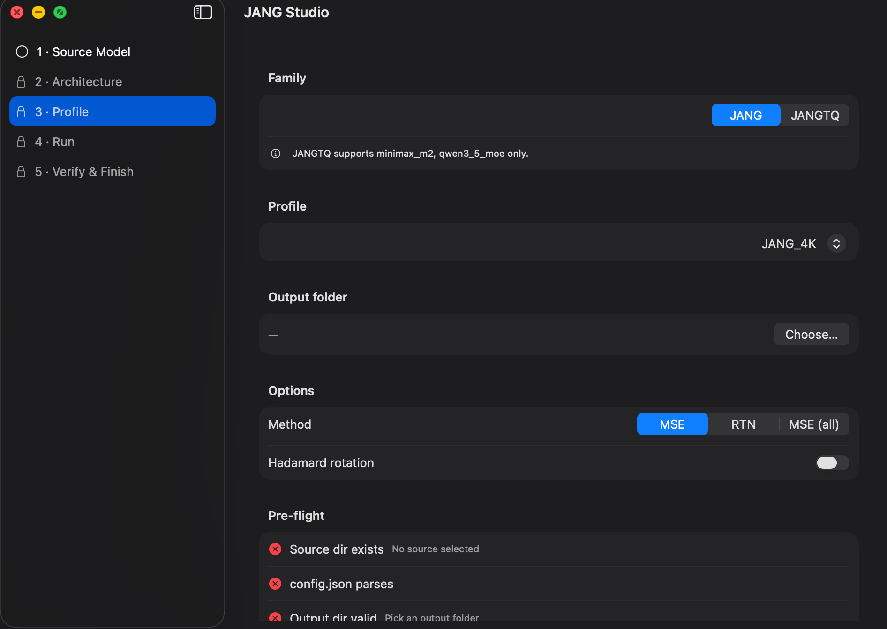
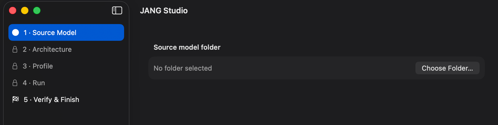
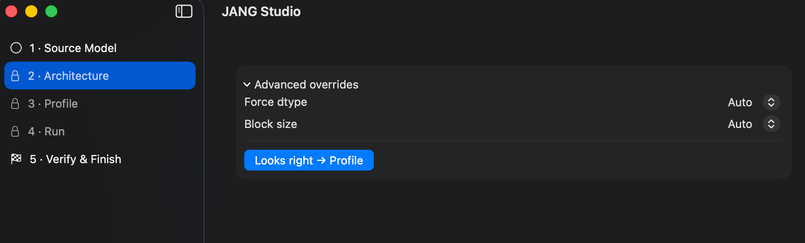

# JANG Studio

**Convert HuggingFace models to JANG — a mixed-precision quantization format for Apple Silicon — with a five-step wizard, live chat preview, and one-click publishing to HuggingFace.**



## What is JANG?

JANG (Jang Adaptive N-bit Grading) is a mixed-precision quantization format for Apple Silicon. A JANG model is a safetensors directory where each tensor is quantized to the bit count that suits its role — attention weights at 6-8 bits, expert MLPs at 2-4 bits — so the model stays coherent at drastically smaller sizes while running at full MLX speed.

**What JANG Studio does for you:**

- Converts any HuggingFace model to JANG or JANGTQ format (dense, MoE, VL, video-VL, MLA, hybrid-SSM — every architecture).
- Ships a self-contained Python 3.11 + MLX runtime inside the `.app` — no Python install needed.
- Runs a 12-row post-convert audit so you know the output is real before you use it.
- Lets you chat with the converted model inside the app.
- Generates Python/Swift/Server/HuggingFace code snippets for your use case.
- Generates a HuggingFace model card and pushes to Hub in one click.

## Install

### Option 1 — download the signed DMG (recommended)

Download the latest `JANGStudio.dmg` from [Releases](https://github.com/jjang-ai/jangq/releases) (first signed DMG lands with tag `jang-studio-v1.0.0`), drag `JANG Studio.app` into `/Applications`.

**System requirements:**
- macOS 15 (Sequoia) or later
- Apple Silicon (M1, M2, M3, M4 — any Ultra/Max/Pro tier)
- RAM ≥ 1.5× source model size (conversion peaks are high)
- Free disk ≥ output model size × 1.1

### Option 2 — build from source

```bash
git clone https://github.com/jjang-ai/jangq
cd jangq

# Build the bundled Python runtime (one-time, ~3 min, produces 305 MB)
cd JANGStudio
Scripts/build-python-bundle.sh

# Build the .app
xcodegen generate
xcodebuild -project JANGStudio.xcodeproj -scheme JANGStudio -configuration Release build

# Launch
open build/Build/Products/Release/JANGStudio.app
```

## Using the app

Screenshots below show the wizard in its empty state (before picking a model). Once you choose a folder, every subsequent step fills in automatically based on what JANG Studio detects.

### Step 1 — Source Model



Click **Choose Folder…** and pick a HuggingFace model directory (one containing `config.json` and `.safetensors` shards). JANG Studio auto-detects:

- `model_type` (llama, qwen3_5_moe, minimax_m2, deepseek_v32, idefics3, gemma3, …)
- Parameter count (approximate, in billions)
- Expert count for MoE models
- Source dtype (BF16 / FP16 / FP8)
- Image-VL vs video-VL capability

It then **recommends a conversion plan** — profile, method, hadamard, force-dtype — based on what it detected. Most beginners can skip Steps 2 and 3 entirely and hit **Start** once the recommendation loads.

### Step 2 — Architecture



Review the auto-detected architecture card. The **Advanced overrides** section is usually not needed — but lets you manually set:

- **Force dtype** — override the auto-detected source dtype. Useful when sniffing fails (rare) or when a 512+ expert model's source uses float16 and you want to force bfloat16.
- **Block size** — the quantization group size. 64 is the default and works on every architecture. 32 gives finer granularity at the cost of metadata overhead; 128 goes the other way.

### Step 3 — Profile


Pick a **JANG** profile (works on every architecture) or **JANGTQ** profile (Qwen 3.6 + MiniMax today, GLM in v1.1). Each profile has a plain-English description visible on hover.

**Options:**
- **Method** — MSE is the default (best quality). RTN is fastest. MSE (all) squeezes out extra quality at the cost of time.
- **Hadamard rotation** — turns on at 3-bit+, off at 2-bit and below (it hurts low-bit quality). JANG Studio auto-picks the right default.

**Pre-flight panel** runs 10 checks live as you change options:
- Source dir exists & readable
- config.json parses
- Output dir valid
- Free disk space sufficient
- RAM adequate (>= 1.5× source)
- JANGTQ arch supported
- JANGTQ source dtype (bf16 or fp8)
- BF16 forced for 512+ expert models
- Hadamard sanity at 2-bit
- Bundled Python runtime healthy

Start button stays disabled until all required checks are green.

### Step 4 — Run

Live macro progress bar (`[N/5] phase`), fine per-tensor bar, streaming log view, ETA display, and peak RAM monitor. Cancel sends SIGTERM (then SIGKILL after 3s); partial output stays on disk for inspection unless you have auto-delete enabled in Settings.

### Step 5 — Verify & Adopt

12-row verifier checklist runs automatically — proves every config file, tokenizer, chat template (inline / `.jinja` / `.json`), shard index, VL preprocessor, MiniMax custom `.py` files, and generation metadata landed correctly. Then the adoption action bar lights up:

- **Test Inference** — chat with the model inside the app (temperature / max-tokens settings, image/video drop zones for VL models, live tok/s + peak RAM)
- **View Usage Examples** — copy Python / Swift / Server / HuggingFace snippets tailored to your model's capabilities (tool-calling, reasoning, VL, video are detected and the snippets change accordingly)
- **Generate Model Card** — HF-compatible `README.md` with license, base model, quantization_config, quick-start snippet
- **Publish to HuggingFace** — dry-run preview (file count + total size) + one-click upload with your HF token

### Settings (⌘,)

Five tabs, 27 persisted preferences, zero hardcoded values in the app:

- **General** — default output parent folder, default profile, default family, default method, default Hadamard, calibration sample count, output naming template (`{basename}` `{profile}` `{family}` `{date}` `{time}` `{user}`), auto-delete partial output, reveal in Finder on finish
- **Advanced** — Python override path, custom jang-tools path, log verbosity (Normal/Verbose/Debug), JSONL log retention lines, log file output dir, tick throttle ms, bundle size warning MB
- **Performance** — MLX thread count, Metal pipeline cache, pre-allocate RAM, concurrent conversions
- **Diagnostics** — always-show "Copy Diagnostics" button, anonymize paths in diagnostics, GitHub issues URL, auto-open issue tracker on crash
- **Updates** — update channel (stable/beta), auto-check, view release notes, about (version/build)

## Using the scripts directly (no app)

The same Python toolkit that powers the app is a standalone pip package:

```bash
pip install 'jang[mlx]'

# Convert a model
python -m jang_tools convert /path/to/HF-model -o /path/to/output -p JANG_4K

# With JSONL progress events (for building your own frontend)
python -m jang_tools --progress=json --quiet-text convert /path/to/HF-model -o /path/to/output -p JANG_4K

# Inspect a source before converting
python -m jang_tools inspect-source --json /path/to/HF-model

# Estimate output size
python -m jang_tools estimate-model --model /path/to/HF-model --profile JANG_4K --json

# List available profiles
python -m jang_tools profiles --json

# After conversion: test inference
python -m jang_tools inference --model /path/to/output --prompt "Hello" --max-tokens 100 --json

# Generate a HuggingFace model card
python -m jang_tools modelcard --model /path/to/output --output README.md

# Generate usage snippets
python -m jang_tools examples --model /path/to/output --lang python --json

# Publish to HuggingFace
export HF_HUB_TOKEN=...
python -m jang_tools publish --model /path/to/output --repo org/model-JANG_4K
```

All 15 subcommands are documented via `python -m jang_tools --help`.

## Using JANG models in your own Swift app

Add to your `Package.swift`:

```swift
dependencies: [
    .package(url: "https://github.com/jjang-ai/jangq", branch: "main")
],
targets: [
    .executableTarget(
        name: "MyApp",
        dependencies: [.product(name: "JANGKit", package: "jangq")]
    )
]
```

Then:

```swift
import JANGKit

let model = try await JANGKit.Model.load(at: modelURL)
let result = try await model.generate(
    prompt: "Hello",
    config: JANGKit.SamplingConfig(temperature: 0.0, maxTokens: 200)
)
print(result.text)
print("\(result.tokensPerSecond) tok/s, \(result.tokens) tokens")
```

`JANGKit.Model.load(at:)` auto-detects JANG vs JANGTQ from `jang_config.json`.

## Using JANG models in Python

```python
from jang_tools.loader import load_jang_model
from mlx_lm import generate

model, tokenizer = load_jang_model("/path/to/JANG-model")
prompt = tokenizer.apply_chat_template(
    [{"role": "user", "content": "Hello"}],
    add_generation_prompt=True
)
response = generate(model, tokenizer, prompt=prompt, max_tokens=200)
print(response)
```

For VL models:
```python
from jang_tools.load_jangtq_vlm import load_jangtq_vlm_model
from mlx_vlm import generate
from PIL import Image

model, processor = load_jangtq_vlm_model("/path/to/JANG-VL-model")
image = Image.open("photo.jpg")
response = generate(model, processor, image=image, prompt="Describe.", max_tokens=200)
```

## Serving a JANG model as an OpenAI-compatible server

```bash
pip install osaurus
osaurus serve --model /path/to/JANG-model --port 8080

curl http://localhost:8080/v1/chat/completions \
  -H "Content-Type: application/json" \
  -d '{"messages":[{"role":"user","content":"Hello"}]}'
```

## Profile cheat sheet

| Bit tier | JANG | JANGTQ |
|---:|:---|:---|
| 1-bit | JANG_1L | — |
| 2-bit | JANG_2S · JANG_2M · JANG_2L | JANGTQ2 |
| 3-bit | JANG_3K · JANG_3S · JANG_3M · JANG_3L | JANGTQ3 |
| 4-bit | **JANG_4K (default)** · JANG_4S · JANG_4M · JANG_4L | JANGTQ4 |
| 5/6-bit | JANG_5K · JANG_6K · JANG_6M | — |

- **JANG** works on every architecture.
- **JANGTQ** (TurboQuant) supports Qwen 3.6 (`qwen3_5_moe`) and MiniMax 2.7 (`minimax_m2`) in v1. GLM JANGTQ is coming in v1.1.
- **K-suffix profiles** (`JANG_3K/4K/5K/6K`) use K-quant style budget-neutral allocation.
- **L-suffix profiles** are the best-quality at a given bit tier.

## Adoption docs for framework authors

Want to add JANG support to your own inference runtime? See:
- [`docs/adoption/README.md`](docs/adoption/README.md) — entry point
- [`docs/adoption/PORTING.md`](docs/adoption/PORTING.md) — on-disk format + dequant math + JANGTQ codebook spec
- [`docs/adoption/EXAMPLES/`](docs/adoption/EXAMPLES/) — runnable Python + Swift examples
- [`FORMAT.md`](FORMAT.md) — canonical format specification

## Publishing guidance

The app's **Publish to HF** button auto-generates a model card with:
- Source model link + license pass-through
- Quantization family, profile, actual bits, size
- Capability tags: vision-language, video, tool-use, reasoning
- Runnable code snippet for Python + Swift
- Link back to JANG Studio

Example published JANG models (for reference): browse the [JANGQ-AI HuggingFace org](https://huggingface.co/JANGQ-AI) for cards auto-generated by the same template the app uses.

## Getting help

- **Bug report:** Click **Copy Diagnostics** in the app's failure banner. It saves a zip to `~/Desktop/` with plan.json + run.log + events.jsonl + system.json. Open an issue at https://github.com/jjang-ai/jangq/issues and attach the zip.
- **Questions:** open a Discussion on the repo.

## Credits

Created by **Jinho Jang** (`eric@jangq.ai`) · [jangq.ai](https://jangq.ai)

JANG Studio is the native macOS companion to the [`jang`](https://pypi.org/project/jang/) Python package. The format spec is open; every piece of JANG is free to port to any runtime.
